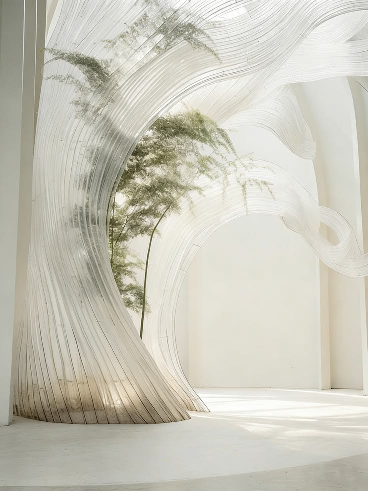
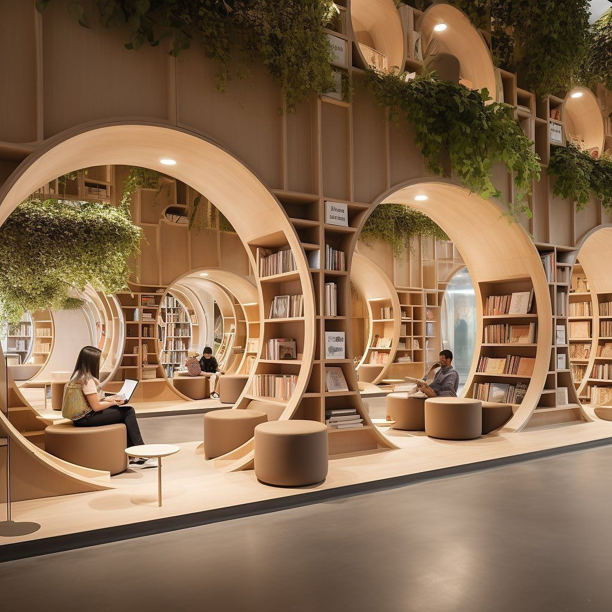

# Bárbara Gutiérrez Tapia

## Perfil

**Disciplina / formación:**Arquitecta 
**Qué hago hoy:** Actualmente trabajo en docencia en taller de primer año a tiempo parcial y paralelamente, organizo una empresa construcciónes y reparaciones de construcciones con pequeña y mediana escala, abordando desde la propuesta de diseño hasta el área constructiva.
 
**Qué me gustaría aprender en este curso:** Aprender del área computacional de forma ordenada, ya que la mayoría de los softwares que manejo han sido por prueba y error, sin tener una guía clara. Me gustaría evaluar si puedo desarrollar cosas más interesantes ya que me encuentro en una zona bastante desconocida para mí.

## Intereses

- Diseño biofilico  
- Arquitectura y bienestar
- Docencia e innovación dentro del aula 

## Una pregunta que me interesa explorar

¿Es posible mejorar la calidad de vida de los usuarios neurotípicos y neurodivergentes aplicando un diseño biofílico? 

## Algo que me inspira

```md
```


```

## Links

- [Referencia 1](https://example.com)
- [Referencia 2](https://example.com)

> No es necesario publicar información personal que no quieras compartir. Este README será parte de un repositorio público durante el laboratorio.
